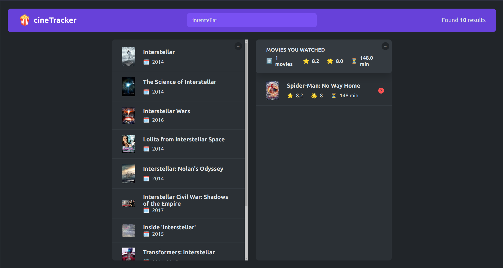

### **CineTracker - Your Movie Companion** 🎬  



**Description**  
CineTracker helps you search, rate, and track your watched movies effortlessly. Built with React, it provides an intuitive interface for movie enthusiasts to discover and manage their film lists.  

**Features**  
✅ Search for movies by title  
✅ Add movies to a watchlist  
✅ Rate and track watched movies  
✅ Responsive UI for all devices  

**Tech Stack**  
- React.js  
- API for movie data OMDb  
- Local Storage for state persistence  

**Installation**  
```sh
git clone https://github.com/your-username/cinetracker.git
cd cinetracker
npm install
npm run dev
```

---
